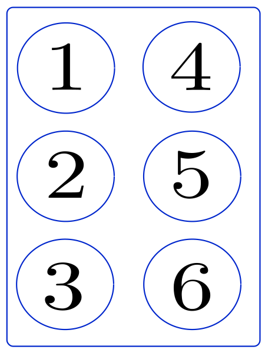
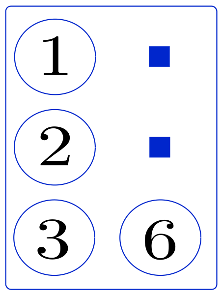

Introducción
===============

Los signos braille
----------------------------------

El lenguaje Braille se basa en una matriz de orden :math:`3\times 2`, tales que los :math:`6` puntos están numerados de la siguiente manera:

- Los puntos de la primer columna se numeran como :math:`1`, :math:`2` y :math:`3`, y

- Los de la segunda columna como :math:`4`, :math:`5` y :math:`6`, siempre de manera descendente (de arriba hacia abajo).

Un dato que me parece interesante es la mayoría de bibliografías señalan que, con una sola matriz, se pueden formar :math:`64` símbolos según estén presentes o no los puntos en cada matriz (incluyendo a la matriz vacía,que no tiene ningún punto). El hecho es que este número es el resultado del problema combinatorio subyacente que tiene como resultado:

.. math::

    \sum_{i=0}^{6} \left (\begin{array}{l} 6 \\ i \end{array}\right ) = 64

Entonces, ya sabemos que existen :math:`64` combinaciones posibles con una sola matriz, y cada una de estas son utilizadas para formar caracters simples con los cuales se pueden representar en Braille los signos gráficos que utilizamos para escribir textos impresos en caracteres visuales.

Enumeración de los puntos
~~~~~~~~~~~~~~~~~~~~~~~~~~~

La enumeración de los puntos que componen un signo Braille de un solo caracter se efectua mediante números de tantas cifras cuantos puntos sean utilizados, empleando para cada punto el dígito que lo identifica.

Por ejemplo, la letra "v minúscula" se forma en braille con los tres puntos :math:`(1,2,3,6)`.

Notemos que, en la imagen anterior, los puntos :math:`4` y :math:`5` no forman parte de este signo, por lo que los señalamos con :math:`\textcolor{blue}{\blacksquare}`.

Pero ocurre que los signos visuales son muchos más que esas :math:`64` posibles combinaciones.

- :ref:`Alfabeto` (contempla las letras minúsculas y mayúsculas),
- :ref:`cifras-numericas`,
- :ref:`signos-de-puntuacion`,
- :doc:`04-operadores-aritmeticos` y
- :doc:`05-alfabeto-griego` (euro, porcentaje, etc.).

.. _Alfabeto-tex:

Escritura en LaTeX
------------------------

Preámbulo
~~~~~~~~~~~~

.. code-block:: latex
    :caption: Preámbulo
    

    \documentclass[draft, 12pt]{article}
    %% ----------------------------  Inicio del Preámbulo  ---------------------------- %%
    \usepackage[spanish]{babel}
    \usepackage[utf8]{inputenc}
    \usepackage[T1]{fontenc}
    \usepackage{fullpage}
    \usepackage[puttinydots]{braille}
    
    \usepackage[lmargin=2.54cm, tmargin=2.54cm, rmargin=2.54cm, bmargin=2.54cm]{geometry}
    
    \title{Escritura con la Fuente Braille en \LaTeX{}}
    \author{Ferreira Juan David}
    \date{\today}
    %% ----------------------------  Fin del Preámbulo    ---------------------------- %%
    \begin{document}

    %%
    %% Cuerpo del documento.
    %%

    \end{document}